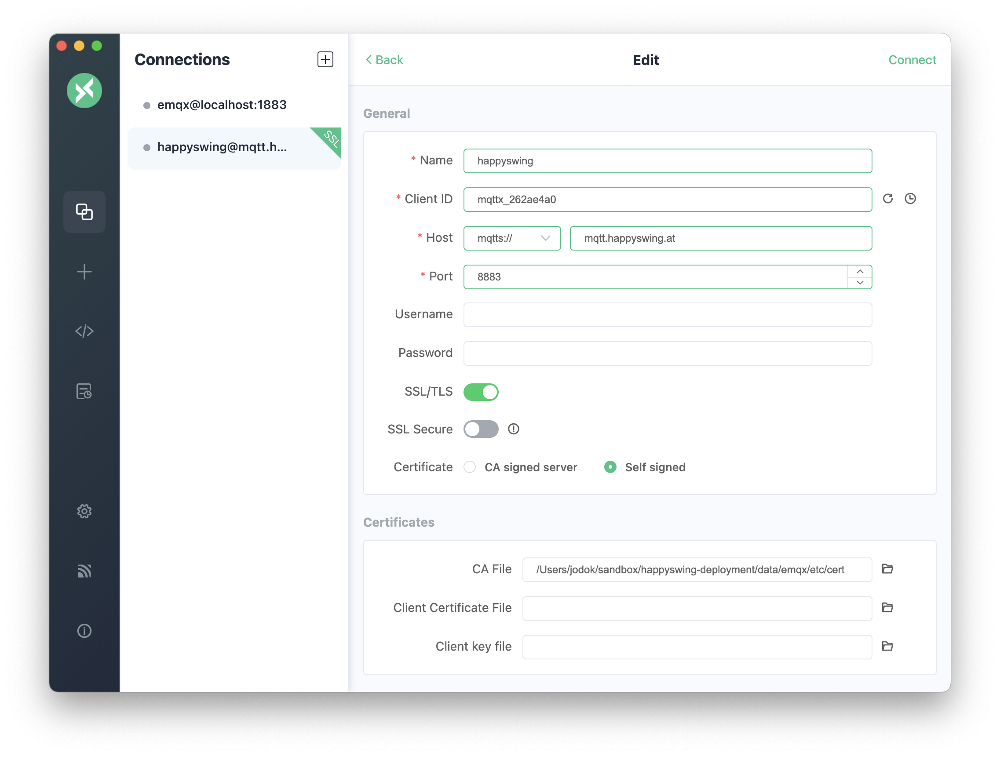

# Deployment files for Happyswing daemons

## MQTT

The Happyswing MQTT server is running on a Hetzner Cloud server. The admin
Interface is exposed behind a NGINX proxy with Letsencrypt SSL:
<https://mqtt.happyswing.at>. The credentials are documented in the private
docs.

The other ports are (Right now, only 1883 is exposed to the public):

Port | Description
--- | ---
1883 | MQTT protocol
8883 | MQTT/SSL
8083 | MQTT/WebSocket
8080 | HTTP API
18083 | Dashboard Management Console

### MQTT Client

The recommended client ist <mqttx.app>. It is available for all major platforms
and is open source.

One will need `data/emqx/etc/certs/cacert.pem` to connect to the server.

The image below shows the configuration for the client. Make sure to disable the
`SSL Secure` setting as e.g. the hostname of the certificate does not match the
actual hostname:

### Backup

The following private files are not checked into the repository and need to be backed up manually::

  data/emqx/etc/certs/key.pem
  data/emqx/etc/certs/client-key.pem
